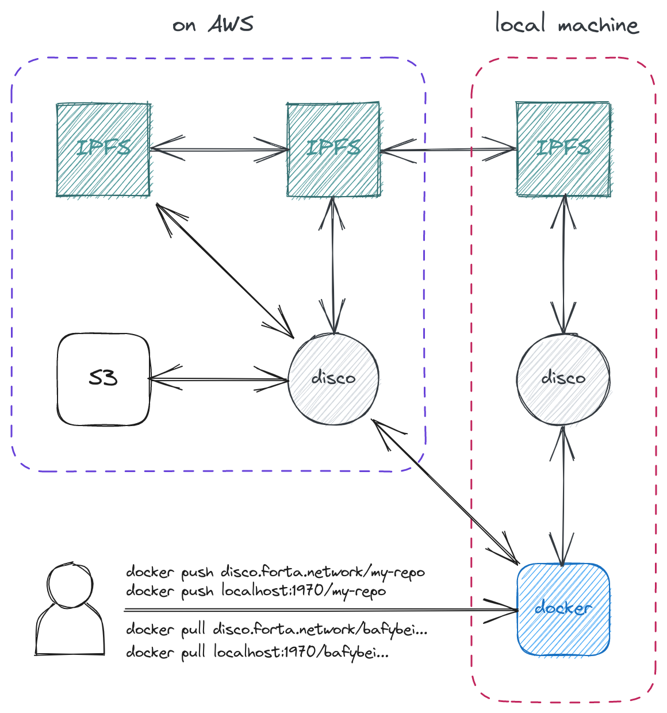

# disco


[OCI Distribution Specification](https://github.com/opencontainers/distribution-spec/blob/main/spec.md) conformant and Docker compatible **dis**tributed **co**ntainer registry, based on the awesome [Distribution](https://github.com/distribution/distribution) library and Kubo MFS API.

Forta Network is currently using Disco in production to serve thousands of detection bot images!

Disco registries share and replicate Docker images on IPFS!

It can be run:

- As a local daemon that you can pull and push to
- As your own hosted Docker registry
- With a cache of your choice (any driver supported by Distribution)



## Quickstart

Disco requires running a [Kubo](https://github.com/ipfs/kubo) node. Start it with:

```
$ ipfs init
$ ipfs daemon
```

Clone the repo:

```
$ git clone https://github.com/forta-network/disco
$ cd disco
```

Build Disco and install it:

```
$ go build -o disco .
$ sudo cp disco /usr/bin/disco
```

Let's configure using the default file:

```
$ mkdir -p ~/.disco
$ cp config/default-config.yaml  ~/.disco/config.yaml
```

Start Disco:

```
$ disco
```

Let's push the busybox image to our local Disco in another terminal:
```
$ docker pull busybox:latest
$ docker tag busybox:latest localhost:1970/my-image
$ docker push localhost:1970/my-image
Using default tag: latest
The push refers to repository [localhost:1970/my-image]
5b8c72934dfc: Pushed 
latest: digest: sha256:dca71257cd2e72840a21f0323234bb2e33fea6d949fa0f21c5102146f583486b size: 527
```

Now, when the push is completed, `my-image` repository no longer exists.

Disco creates two image repositories for us by rewriting the storage:
- `dca71257cd2e72840a21f0323234bb2e33fea6d949fa0f21c5102146f583486b`: The digest repository
- `bafybeibbkcck6lz37hcipp2mwtfdgstydizjq45z4fkqq4va73mp7qzutu`: The IPFS CID v1 repository

We are able to discover the content addressable image reference by pulling all tags of the digest image:
```
$ docker pull -a localhost:1970/dca71257cd2e72840a21f0323234bb2e33fea6d949fa0f21c5102146f583486b
bafybeibbkcck6lz37hcipp2mwtfdgstydizjq45z4fkqq4va73mp7qzutu: Pulling from dca71257cd2e72840a21f0323234bb2e33fea6d949fa0f21c5102146f583486b
```

Our Docker image is reference is `bafybeibbkcck6lz37hcipp2mwtfdgstydizjq45z4fkqq4va73mp7qzutu`!

This is pullable from the same or any other Disco.

## Configuration

```yaml
version: 0.1
log:
  level: debug
  fields:
    service: disco
    environment: development
storage:
  ipfs:
	  # You can work with multiple Kubo nodes.
	  # The content is multiplexed when reading and writing.
    # Peer your nodes with each other if you are using multiple.
    router:
      nodes:
        - url: http://localhost:5001
        # - url: http://other.url
	# This allows replicating to a secondary storage (cache)
	# and serving from there so that the IPFS nodes do not
	# take load when serving content in a centralized setup.
    # cache:
    #   s3:
    #     accesskey: awsaccesskey
    #     secretkey: awssecretkey
    #     region: us-west-1
    #     regionendpoint: http://myobjects.local
    #     bucket: bucketname
    #     encrypt: true
    #     keyid: mykeyid
    #     secure: true
    #     v4auth: true
    #     chunksize: 5242880
    #     multipartcopychunksize: 33554432
    #     multipartcopymaxconcurrency: 100
    #     multipartcopythresholdsize: 33554432
    #     rootdirectory: /s3/object/name/prefix
    # redirect: https://serve.blobs.directly.from.bucket.url
  maintenance:
    uploadpurging:
      enabled: false
# disco:
#   noclone: true
http:
  addr: :5000
  debug:
    addr: :5050
    prometheus:
      enabled: true
      path: /metrics
  headers:
    X-Content-Type-Options: [nosniff]
```

## FAQ

### Q1: How does Disco store images to Kubo?

The [Distribution](https://github.com/distribution/distribution) library defines an interface which any storage driver needs to implement in order to be an option.

The trick is implementing this driver to write to and read from the Mutable File System available in Kubo implementation. This is accessible through the [Kubo RPC API](https://docs.ipfs.tech/reference/kubo/rpc/).

The written repository definitions, by default, are IPLD DAGs and have an IPFS CID v1 hash. This hash is compatible with Docker's image naming conventions. Disco renames the uploaded repositories to their digest hash and CID v1 hash.

### Q2: Pulling from another Disco seems to hang. Why is that?

Content resolution in one large network using DHT routing is a major challenge in IPFS. With the right networking configuration, one might observe that the resolution and cloning of repositories can eventually succeed. However, this can be slow.

There are a couple solutions that helps improve this:
- **Use a pinning service:** Kubo nodes have an IPFS Pinning Service API which support providers such as Pinata. When this configuration is made, Kubo starts pushing MFS contents to Pinata for pinning. This allows faster discovery of the content! You can find out more [here](https://docs.ipfs.tech/how-to/work-with-pinning-services/).

- **Set up delegated routing:** As a more recent and advanced solution, Kubo nodes support a new protocol called delegated routing which allows setting up your own routing system and letting your IPFS nodes use that! This can also be helpful in using an isolated IPFS network as an efficient Docker image sharing network. You can find out more [here](https://docs.ipfs.tech/how-to/work-with-pinning-services/).

### Q3: Can I produce a different hash for an image after pusing for the second time?

Yes. This can be confusing but there is an explanation.

Kubo chunks given files into blocks and computes the hashes of the DAGs that represent the file. When files are below the default chunk size limit, this inconsistency is not a case. However, Docker images can contain large layers that exceed the chunk size limit.

Kubo can chunk intermediary blocks in varying sizes, even though the file that is constructed upon merging all blocks is always the same. This causes having a different CID for some of the blobs and having different `disco.json` file to be created within the repository. So the Disco image hash can sometimes be a completely different one.

### Q4: Can I serve my repository for pulls? Does that scale?

Disco allows specifying a secondary storage (cache) as explained in the [Configuration](#configuration) section.
- At the time of pushing, the repository definitions and the blobs are clones to the secondary storage.
- At the time of pulling, Disco hits to the secondary storage first to return the image manifest and redirects the Docker Engine on your computer (which pulls your image) to the redirect URL for direct downloads.

As a result, with the useful configuration, it is possible to make Disco never touch the Kubo nodes.

This is both a centralized and a decentralized configuration as pulls are scalable and the content is still served over IPFS!
